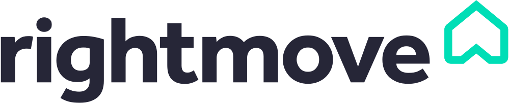

# ScrapFly Scrapers 🕷️

This repository contains educational example scrapers for popular web scraping targets using the [ScrapFly](https://scrapfly.io) web scraping API and Python.  
Most Scrapers use a simple web scraping stack:
- Python version 3.10+
- [Scrapfly's Python SDK](https://github.com/scrapfly/python-scrapfly) for sending HTTP request, bypass blocking and parsing the HTML using the built-in [parsel](https://pypi.org/project/parsel/) selector.
- [asyncio](https://pypi.org/project/asyncio/) for writing concurrent code using the async/await syntax.
- [JMESPath](https://pypi.org/project/jmespath/) and [nested-lookup](https://pypi.org/project/nested-lookup/) for JSON parsing when needed.
- [loguru](https://pypi.org/project/loguru/) for logging.

To learn more about web scraping see our full tutorials on how to scrape these targets (and many others) see the [scrapeguide directory](https://scrapfly.io/blog/tag/scrapeguide/).  

## Fair Use and Legal Disclaimer

This repository contains _educational_ reference material to illustrate how accessible web scraping can be and the provided programs are not intented to be used in web scraping production. 
That being said, Scrapfly team is constantly updating and improving all of this code for optimal experience. 

Scrapfly does not offer legal advice and as always, consult a lawyer when creating programs that interact with other people's websites though here's a good general intro of what NOT to do:
- Do not store PII (personally identifiable information) of EU citizens who are protected by GDPR.
- Do not scrape and repurpose entire public datasets which can be protected by database protection laws in some countries.
- Do not scrape at rates that could damage the website and scrape only publicly available data.

## Setup and Run
1. Install the required libraries:
```shell
$ pip install scrapfly-sdk[all] jmespath loguru nested-lookup  
```
2. Export your ScrapFly API key  
- On Mac:
```shell
$ export SCRAPFLY_KEY="YOUR SCRAPFLY KEY"
```
- On Windows:
```shell
$ setx SCRAPFLY_KEY "YOUR SCRAPFLY KEY"
```
3. cd into the scraper directory and run the code:
```shell
$ cd ./example-scraper
$ python run.py
```

## List of Scrapers
The following is the list of supported websites grouped by type.
### E-Commerce
- [Aliexpress.com](#aliexpress)
- [Amazon.com](#amazon)
- [BestBuy.com](#bestbuy)
- [Ebay.com](#ebay)
- [Etsy.com](#etsy)
- [Leboncoin.fr](#leboncoin)
- [Walmart.com](#walmart)

### Fashion
- [Fashionphile.com](#fashionphile)
- [Goat.com](#goat)
- [Nordstorm.com](#nordstorm)
- [Stockx.com](#stockx)
- [Vestiaire collective.com](#vestiaire-collective)

### Jobs and Companies
- [Crunchbase.com](#crunchbase)
- [G2.com](#g2)
- [Glassdoor.com](#glassdoor)
- [Indeed.com](#indeed)
- [Zoominfo.com](#zoominfo)
- [Wellfound.com](#wellfound)
- [Linkedin.com](#linkedin)

### Real Estate
- [Domain.com.au](#domain)
- [Idealista.com](#idealista)
- [Homegate.ch](#homegate)
- [Immobilienscout24.de](#immobilienscout24)
- [Immoscout24.ch](#immoscout24)
- [Immowelt.de](#immowelt)
- [Realestate.com.au](#realestate)
- [Realtor.com](#realtor)
- [Redfin.com](#redfin)
- [Rightmove.co.uk](#rightmove)
- [Seloger.com](#seloger)
- [Zillow.com](#zillow)
- [Zoopla.co.uk](#zoopla)

### Reviews
- [Yellowpages.com](#yellowpages)
- [Yelp.com](#yelp)
- [Trustpilot.com](#trustpilot)

### Search Engines
- [Bing.com](#bing)
- [Similarweb.com](#similarweb)

### Social Media
- [Instagram.com](#instagram)
- [Reddit.com](#reddit)
- [Threads.net](#threads)
- [Tiktok.com](#tiktok)
- [Twitter.com](#twitterx)

### Travel
- [Booking.com](#booking)
- [Tripadvisor.com](#tripadvisor)

------------

### Aliexpress
<!-- <p align="left">
  
</p> -->

The [aliexpress.com scraper](./aliexpress-scraper/) can scrape the following data:

- Product pages for a specific product data.
- Search pages for product listing data.
- Product reviews.

<details class="is-code">
  <summary>View sample data</summary>  

  - [Product pages](./aliexpress-scraper/results/product.json)  
  - [Search pages](./aliexpress-scraper/results/search.json)  
  - [Product reviews](./aliexpress-scraper/results/reviews.json) 

</details>  

For the full guide, refer to our blog article [How to Scrape Aliexpress.com (2023 Update)](https://scrapfly.io/blog/how-to-scrape-aliexpress/)

### Amazon
<!-- <p align="left">
  
</p> -->

The [amazon.com scraper](./amazon-scraper/) can scrape the following data:
- Product pages for a specific product data.
- Search pages for product listing data.
- Product reviews.

<details class="is-code">
  <summary>View sample data</summary>  

  - [Product pages](./amazon-scraper/results/product.json)  
  - [Search pages](./amazon-scraper/results/search.json)  
  - [Product reviews](./amazon-scraper/results/reviews.json) 

</details>  

For the full guide, refer to our blog article [How to Scrape Amazon.com Product Data and Reviews](https://scrapfly.io/blog/how-to-scrape-amazon/)

### BestBuy

The [bestbuy.com scraper](./bestbuy-scraper/) can scrape the following data:
- BestBuy sitemaps for URLs.
- BestBuy product pages for product data.
- BestBuy search pages for product data on search pages.
- BestBuy review pages for review data

<details class="is-code">
  <summary>View sample data</summary>  

  - [Sitemap pages](./bestbuy-scraper/results/promos.json)
  - [Product pages](./bestbuy-scraper/results/products.json)
  - [Review pages](./bestbuy-scraper/results/reviews.json)
  - [Search pages](./bestbuy-scraper/results/search.json) 

</details>  

For the full guide, refer to our blog article [How to Scrape BestBuy Product, Offer and Review Data](https://scrapfly.io/blog/how-to-scrape-bestbuy-product-offer-and-review-data/)

### Bing
The [bing.com scraper](./bing-scraper/) can scrape the following data:
- Search pages for search results (SERPs) data.
- Search pages for keyword data.
- Search page for rich snippet data.

<details class="is-code">
  <summary>View sample data</summary>  

  - [SERP data](./bing-scraper/results/serps.json)  
  - [Keyword data](./bing-scraper/results/keywords.json)
  - [Rich snippet data](./bing-scraper/results/rich_snippets.json)

</details>  

For the full guide, refer to our blog article [How to Scrape Bing Search with Python](https://scrapfly.io/blog/how-to-scrape-bing-search-using-python/)

### Booking

<!-- <p align="left">
  
</p> -->

The [booking.com scraper](./bookingcom-scraper/) can scrape the following data:
- Hotel pages for a specific hotel data.
- Search pages for hotel listing data.

<details class="is-code">
  <summary>View sample data</summary>  

  - [Hotel pages](./bookingcom-scraper/results/hotel.json)  
  - [Search pages](./bookingcom-scraper/results/search.json)  

</details>  

For the full guide, refer to our blog article [How to Scrape Booking.com (2023 Update)](https://scrapfly.io/blog/how-to-scrape-bookingcom/)

### Crunchbase
<!-- <p align="left">
  
</p> -->

The [crunchbase.com scraper](./crunchbase-scraper/) can scrape the following data:
- Company pages for a specific company data.
- Investor pages for a specific investor data.
- Search pages for hotel listing data.

<details class="is-code">
  <summary>View sample data</summary>  

  - [Company pages](./crunchbase-scraper/results/company.json)  
  - [Investor pages](./crunchbase-scraper/results/person.json)  

</details> 

For the full guide, refer to our blog article [How to Scrape Crunchbase Company and People Data (2023 Update)](https://scrapfly.io/blog/how-to-scrape-crunchbase/)

### Domain
<!-- <p align="left">
  
</p> -->

The [domain.com.au scraper](./domaincom-scraper/) can scrape the following data:
- Property pages for a specific real estate property data.
- Search pages for real estate property listings data.

<details class="is-code">
  <summary>View sample data</summary>  

  - [Property pages](./domaincom-scraper/results/properties.json)  
  - [Search pages](./domaincom-scraper/results/search.json)  

</details> 

For the full guide, refer to our blog article [How to Scrape Domain.com.au Real Estate Property Data](https://scrapfly.io/blog/how-to-scrape-domain-com-au-real-estate-property-data/)

### Ebay
<!-- <p align="left">
  
</p> -->

The [ebay.com scraper](./ebay-scraper/) can scrape the following data:
- Product pages for a specific product data.
- Search pages for product listings data.

<details class="is-code">
  <summary>View sample data</summary>  

  - [Product pages](./ebay-scraper/results/product.json)  
  - [Product pages with variant](./ebay-scraper/results/product-with-variants.json)  
  - [Search pages](./ebay-scraper/results/search.json)  

</details> 

For the full guide, refer to our blog article [How to Scrape Ebay using Python](https://scrapfly.io/blog/how-to-scrape-ebay/)

### Etsy
<!-- <p align="left">
  
</p> -->

The [etsy.com scraper](./etsy-scraper/) can scrape the following data:
- Product pages for a specific product data.
- Shop pages for a specific shop data.
- Search pages for product listings data.

<details class="is-code">
  <summary>View sample data</summary>  

  - [Product pages](./etsy-scraper/results/products.json)  
  - [Shop pages](./etsy-scraper/results/shops.json)  
  - [Search pages](./etsy-scraper/results/search.json)  

</details> 

For the full guide, refer to our blog article

### Fashionphile
<!-- <p align="left">
  
</p> -->

The [fashionphile.com scraper](./fashionphile-scraper/) can scrape the following data:
- Product pages for product data.
- Search pages for product listing data.

<details class="is-code">
  <summary>View sample data</summary>  

  - [Product pages](./fashionphile-scraper/results/products.json)  
  - [Search pages](./fashionphile-scraper/results/search.json)  

</details> 

For the full guide, refer to our blog article [How to Scrape Fashionphile for Second Hand Fashion Data](https://scrapfly.io/blog/how-to-scrape-fashionphile/)

### Glassdoor
<!-- <p align="left">
  
</p> -->

The [glassdoor.com scraper](./glassdoor-scraper/) can scrape the following data:
- Company search for company page URLs (overiew, jobs, reviews, salaries).
- Job pages for a specific job data.
- Salary pages for a specific company salaries data.
- Review pages for a specific company reviews data.

<details class="is-code">
  <summary>View sample data</summary>  

  - [Job pages](./glassdoor-scraper/results/jobs.json)  
  - [Review pages](./glassdoor-scraper/results/reviews.json)  
  - [Salary pages](./glassdoor-scraper/results/salaries.json)  

</details> 

For the full guide, refer to our blog article [How to Scrape Glassdoor (2023 update)](https://scrapfly.io/blog/how-to-scrape-glassdoor/)

### Goat
<!-- <p align="left">
  
</p> -->

The [goat.com scraper](./goat-scraper/) can scrape the following data:
- Product pages for product data.
- Search pages for product listing data.

<details class="is-code">
  <summary>View sample data</summary>  

  - [Product pages](./goat-scraper/results/products.json)  
  - [Search pages](./goat-scraper/results/search.json)  

</details> 

For the full guide, refer to our blog article [How to Scrape Goat.com for Fashion Apparel Data in Python](https://scrapfly.io/blog/how-to-scrape-goat-com-fashion-apparel/)

### Homegate
<!-- <p align="left">
  
</p> -->

The [homegate.ch scraper](./homegate-scraper/) can scrape the following data:
- Property pages for a specific real estate property data.
- Search pages for real estate property listings data.

<details class="is-code">
  <summary>View sample data</summary>  

  - [Property pages](./homegate-scraper/results/properties.json)  
  - [Search pages](./homegate-scraper/results/search.json)  

</details> 

For the full guide, refer to our blog article [How to Scrape Homegate.ch Real Estate Property Data](https://scrapfly.io/blog/how-to-scrape-homegate-ch-real-estate-property-data/)

### Idealista
<!-- <p align="left">
  
</p> -->

The [idealista.com scraper](./idealista-scraper/) can scrape the following data:
- Property pages for a specific real estate property data.
- Search pages for real estate property listings data.
- Provinces pages for search pages URLs.

<details class="is-code">
  <summary>View sample data</summary>  

  - [Property pages](./idealista-scraper/results/properties.json)  
  - [Search pages](./idealista-scraper/results/search.json)  
  - [Provinces pages](./idealista-scraper/results/search_URLs.json)

</details> 

For the full guide, refer to our blog article [How to Scrape Idealista.com in Python - Real Estate Property Data](https://scrapfly.io/blog/how-to-scrape-idealista/)

### Immobilienscout24
<!-- <p align="left">
  
</p> -->

The [immobilienscout24.de scraper](./immobilienscout24-scraper/) can scrape the following data:
- Property pages for a specific real estate property data.
- Search pages for real estate property listings data.

<details class="is-code">
  <summary>View sample data</summary>  

  - [Property pages](./immobilienscout24-scraper/results/properties.json)  
  - [Search pages](./immobilienscout24-scraper/results/search.json)  

</details> 

For the full guide, refer to our blog article [How to Scrape Immobilienscout24.de Real Estate Data](https://scrapfly.io/blog/how-to-scrape-immobillienscout24-real-estate-property-data/)

### Immoscout24
<!-- <p align="left">
  
</p> -->

The [immoscout24.ch scraper](./immoscout24-scraper/) can scrape the following data:
- Property pages for a specific real estate property data.
- Search pages for real estate property listings data.

<details class="is-code">
  <summary>View sample data</summary>  

  - [Property pages](./immoscout24-scraper/results/properties.json)  
  - [Search pages](./immoscout24-scraper/results/search.json)  

</details> 

For the full guide, refer to our blog article [How to Scrape Immoscout24.ch Real Estate Property Data](https://scrapfly.io/blog/how-to-scrape-immoscout24-ch-real-estate-property-data/)

### Immowelt
<!-- <p align="left">
  
</p> -->

The [immowelt.de scraper](./immowelt-scraper/) can scrape the following data:
- Property pages for a specific real estate property data.
- Search pages for real estate property listings data.

<details class="is-code">
  <summary>View sample data</summary>  

  - [Property pages](./immowelt-scraper/results/properties.json)  
  - [Search pages](./immowelt-scraper/results/search.json)  

</details> 

For the full guide, refer to our blog article [How to Scrape Immowelt.de Real Estate Data](https://scrapfly.io/blog/how-to-scrape-immowelt-de-real-estate-properties/)

### Indeed
<!-- <p align="left">
  
</p> -->

The [indeed.com scraper](./indeed-scraper/) can scrape the following data:
- Job pages for a specific job data.
- Search pages for job listings data.

<details class="is-code">
  <summary>View sample data</summary>  

  - [Job pages](./indeed-scraper/results/jobs.json)  
  - [Search pages](./indeed-scraper/results/search.json)  

</details> 

For the full guide, refer to our blog article [How to Scrape Indeed.com (2023 Update)](https://scrapfly.io/blog/how-to-scrape-indeedcom/)

### Instagram
<!-- <p align="left">
  
</p> -->

The [instagram.com scraper](./instagram-scraper/) can scrape the following data:
- User pages for a specific user data.
- Post Pages for a specific post data.

<details class="is-code">
  <summary>View sample data</summary>  

  - [User](./instagram-scraper/results/user.json)  
  - [All user posts](./instagram-scraper/results/all-user-posts.json)  
  - [Multi image post](./instagram-scraper/results/multi-image-post.json)  
  - [Video Post](./instagram-scraper/results/video-post.json)  

</details> 

For the full guide, refer to our blog article [How to Scrape Instagram](https://scrapfly.io/blog/how-to-scrape-instagram/)

### Leboncoin
<!-- <p align="left">
  
</p> -->

The [leboncoin.fr scraper](./leboncoin-scraper/) can scrape the following data:
- product pages for a specific product data.
- Search pages for product listing data.

<details class="is-code">
  <summary>View sample data</summary>  

  - [Ad pages](./leboncoin-scraper/results/ad.json)  
  - [Search pages](./leboncoin-scraper/results/search.json)  

</details> 

For the full guide, refer to our blog article [How to Web Scrape Leboncoin.fr using Python](https://scrapfly.io/blog/how-to-scrape-leboncoin-marketplace-real-estate/)

### Nordstorm
<!-- <p align="left">
  
</p> -->

The [nordstorm.com scraper](./nordstorm-scraper/) can scrape the following data:
- Product pages for product data.
- Search pages for product listing data.

<details class="is-code">
  <summary>View sample data</summary>  

  - [Product pages](./nordstorm-scraper/results/products.json)  
  - [Search pages](./nordstorm-scraper/results/search.json)  

</details> 

For the full guide, refer to our blog article [How to Scrape Nordstrom Fashion Product Data](https://scrapfly.io/blog/how-to-scrape-nordstrom/)

### Realestate
<!-- <p align="left">
  
</p> -->

The [realestate.com.au scraper](./realestatecom-scraper/) can scrape the following data:
- Property pages for a specific real estate property data.
- Search pages for real estate property listings data.

<details class="is-code">
  <summary>View sample data</summary>  

  - [Property pages](./realestatecom-scraper/results/properties.json)  
  - [Search pages](./realestatecom-scraper/results/search.json)  

</details> 

For the full guide, refer to our blog article [How to Scrape Realestate.com.au Property Listing Data](https://scrapfly.io/blog/how-to-scrape-realestate-com-au-property-listing-data/)

### Realtor
<!-- <p align="left">
  
</p> -->

The [realtor.com scraper](./realtor-scraper/) can scrape the following data:
- Property pages for a specific real estate property data.
- Search pages for real estate property listings data.
- Feed pages for newly added propery listings data.

<details class="is-code">
  <summary>View sample data</summary>  

  - [Property pages](./realtor-scraper/results/properties.json)  
  - [Search pages](./realtor-scraper/results/search.json)  
  - [Feed pages](./realtor-scraper/results/feed.json)  

</details> 

For the full guide, refer to our blog article [How to Scrape Realtor.com - Real Estate Property Data](https://scrapfly.io/blog/how-to-scrape-realtorcom/)

### Reddit

The [reddit.com scraper](./reddit-scraper/) can scrape the following data:
- Reddit subreddit pages for subbreddit and post data.
- Reddit post pages for post and comment data.
- Reddit user profile pages for post data.
- Reddit user profile pages for comment data.

<details class="is-code">
  <summary>View sample data</summary>  

  - [Subreddit pages](./reddit-scraper/results/subreddit.json)  
  - [Post pages](./reddit-scraper/results/post.json)  
  - [User comment pages](./reddit-scraper/results/user_comments.json)
  - [User post pages](./reddit-scraper/results/user_posts.json)


</details> 

For the full guide, refer to our blog article


### Redfin
<!-- <p align="left">
  
</p> -->

The [redfin.com scraper](./redfin-scraper/) can scrape the following data:
- Property pages for a specific real estate property data.
- Search pages for real estate property listings data.

<details class="is-code">
  <summary>View sample data</summary>  

  - [Property pages for sale](./redfin-scraper/results/properties_for_sale.json)  
  - [Property pages for rent](./redfin-scraper/results/properties_for_rent.json)  
  - [Search pages](./redfin-scraper/results/search.json)  

</details> 

For the full guide, refer to our blog article [How to Scrape Redfin Real Estate Property Data in Python](https://scrapfly.io/blog/how-to-scrape-redfin/)

### Rightmove
<!-- <p align="left">
  
</p> -->

The [rightmove.co.uk scraper](./rightmove-scraper/) can scrape the following data:
- Property pages for a specific real estate property data.
- Search pages for real estate property listings data.

<details class="is-code">
  <summary>View sample data</summary>  

  - [Property pages](./rightmove-scraper/results/properties.json)  
  - [Search pages](./rightmove-scraper/results/search.json)  

</details> 

For the full guide, refer to our blog article [How to Scrape RightMove Real Estate Property Data with Python](https://scrapfly.io/blog/how-to-scrape-rightmove/)

### Seloger
<!-- <p align="left">
  
</p> -->

The [seloger.com scraper](./seloger-scraper/) can scrape the following data:
- Property pages for a specific real estate property data.
- Search pages for real estate property listings data.

<details class="is-code">
  <summary>View sample data</summary>  

  - [Property pages](./seloger-scraper/results/property.json)  
  - [Search pages](./seloger-scraper/results/search.json)  

</details> 

For the full guide, refer to our blog article [How to Scrape Seloger.com - Real Estate Listing Data](https://scrapfly.io/blog/how-to-scrape-seloger-com-listing-real-estate-ads/)

### Similarweb
<!-- <p align="left">
  
</p> -->

The [similarweb.com scraper](./similarweb-scraper/) can scrape the following data:
- Similarweb.com website pages for website traffic inisghts
- Similarweb.com website comparing pages for comparing insights
- Similarweb.com website trend pages for trending websites data
- Similarweb.com sitemaps for urls

<details class="is-code">
  <summary>View sample data</summary>  

  - [Website pages](./similarweb-scraper/results/websites.json)
  - [Website compare pages](./similarweb-scraper/results/websites_compare.json)  
  - [Trend pages](./similarweb-scraper/results/trends.json)  
  - [Sitemaps](./similarweb-scraper/results/sitemap_urls.json)  

</details> 

For the full guide, refer to our blog article [How to Scrape SimilarWeb Website Traffic Analytics
](https://scrapfly.io/blog/how-to-scrape-similarweb/)

### Stockx
<!-- <p align="left">
  
</p> -->

The [stockx.com scraper](./stockx-scraper/) can scrape the following data:
- Product pages for a specific product data.
- Search pages for product listings data.

<details class="is-code">
  <summary>View sample data</summary>  

  - [Property pages](./stockx-scraper/results/product.json)  
  - [Search pages](./stockx-scraper/results/search.json)  

</details> 

For the full guide, refer to our blog article [How to Scrape StockX e-commerce Data with Python](https://scrapfly.io/blog/how-to-scrape-stockx/)

### Threads
<!-- <p align="left">
  
</p> -->

The [threads.net scraper](./threads-scraper/) can scrape the following data:
- User pages for a specific user data.
- Theads Pages for a specific thread data.

<details class="is-code">
  <summary>View sample data</summary>  

  - [Profile pages](./threads-scraper/results/profile.json)  
  - [Thread pages](./threads-scraper/results/thread.json)  

</details> 

For the full guide, refer to our blog article [How to scrape Threads by Meta using Python (2023-08 Update)](https://scrapfly.io/blog/how-to-scrape-threads/)

### TikTok

The [tiktok.com scraper](./tiktok-scraper/) can scrape the following data:
- TikTok post pages for post/video data.
- TikTok comments for comment data on a specific post/video.
- TikTok profile pages for profile data.
- TikTok channel pages for video data.
- TikTok search pages for video data on search results. It can scrape profiles as well.

<details class="is-code">
  <summary>View sample data</summary>  

  - [Comment data](./tiktok-scraper/results/comments.json)  
  - [Post data](./tiktok-scraper/results/posts.json)
  - [Profile data](./tiktok-scraper/results/profiles.json)
  - [Channel data](./tiktok-scraper/results/channel.json)
  - [Search data](./tiktok-scraper/results/search.json)


</details> 

For the full guide, refer to our blog article [How To Scrape TikTok in 2024
](https://scrapfly.io/blog/how-to-scrape-tiktok-python-json/)

### Tripadvisor
<!-- <p align="left">
  
</p> -->

The [tripadvisor.com scraper](./tripadvisor-scraper/) can scrape the following data:
- Holtel pages for a specific hotel data.
- Holtes data in a specific location.
- Search pages for hotel listings data.

<details class="is-code">
  <summary>View sample data</summary>  

  - [Hotel pages](./tripadvisor-scraper/results/hotels.json)  
  - [Search pages](./tripadvisor-scraper/results/search.json)  
  - [Location pages](./tripadvisor-scraper/results/location.json)  

</details> 

For the full guide, refer to our blog article [How to Scrape TripAdvisor.com (2023 Updated)](https://scrapfly.io/blog/how-to-scrape-tripadvisor/)

### Trustpilot
<!-- <p align="left">
  
</p> -->
The [trustpilot.com scraper](./trustpilot-scraper/) can scrape the following data:
- Company pages for a specific company data.
- Reviews data in a specific company reviews.
- Search pages for company listings data.

<details class="is-code">
  <summary>View sample data</summary>  

  - [Company pages](./trustpilot-scraper/results/companies.json)  
  - [Reviews pages](./trustpilot-scraper/results/reviews.json)  
  - [Search pages](./trustpilot-scraper/results/search.json)  

</details> 

For the full guide, refer to out blog article [How to Scrape Trustpilot.com Reviews and Company Data](https://scrapfly.io/blog/how-to-scrape-trustpilot-com-reviews/)

### Twitter(X)
<!-- <p align="left">
  
</p> -->

The [twitter.com scraper](./twitter-scraper/) can scrape the following data:
- Twitter tweet pages for a specific tweet data.
- Twitter user pages for a specific user data.

<details class="is-code">
  <summary>View sample data</summary>  

  - [Profile pages](./twitter-scraper/results/profile.json)  
  - [Tweet pages](./twitter-scraper/results/tweet.json)  

</details> 

For the full guide, refer to our blog article [How to Scrape X.com (Twitter) using Python (2023-11 Update)](https://scrapfly.io/blog/how-to-scrape-twitter/)

### Vestiaire collective
<!-- <p align="left">
  
</p> -->

The [vestiairecollective.com scraper](./vestiairecollective-scraper/) can scrape the following data:
- Product pages for product data.
- Search pages for product listing data.

<details class="is-code">
  <summary>View sample data</summary>  

  - [Product pages](./vestiairecollective-scraper/results/products.json)  
  - [Search pages](./vestiairecollective-scraper/results/search.json)  

</details> 

For the full guide, refer to our blog article [How to Scrape Vestiaire Collective for Fashion Product Data](https://scrapfly.io/blog/how-to-scrape-vestiairecollective/)

### G2
<!-- <p align="left">
  
</p> -->

The [g2.com scraper](./g2-scraper/) can scrape the following data:
- Review pages for company reviews.
- Search pages for company data.
- Alternative pages for company alternatives.

<details class="is-code">
  <summary>View sample data</summary>  

  - [Review pages](./g2-scraper/results/reviews.json)  
  - [Search pages](./g2-scraper/results/search.json)  
  - [Alternatives pages](./g2-scraper/results/alternatives.json)  

</details> 

For the full guide, refer to our blog article [How to Scrape G2 Company Data and Reviews](https://scrapfly.io/blog/how-to-scrape-g2-company-data-and-reviews/)


### Walmart
<!-- <p align="left">
  
</p> -->

The [walmart.com scraper](./walmart-scraper/) can scrape the following data:
- Product pages for product data.
- Search pages for product listing data.

<details class="is-code">
  <summary>View sample data</summary>  

  - [Product pages](./walmart-scraper/results/products.json)  
  - [Search pages](./walmart-scraper/results/search.json)  

</details> 

For the full guide, refer to our blog article [How to Web Scrape Walmart.com (2023 Update)](https://scrapfly.io/blog/how-to-scrape-walmartcom/)

### Wellfound
<!-- <p align="left">
  
</p> -->

The [wellfound.com scraper](./wellfound-scraper/) can scrape the following data:
- Company pages for company data.
- Search pages for job listing data.

<details class="is-code">
  <summary>View sample data</summary>  

  - [Company pages](./wellfound-scraper/results/companies.json)  
  - [Search pages](./wellfound-scraper/results/search.json)  

</details> 

For the full guide, refer to our blog article [How to Scrape Wellfound Company Data and Job Listings](https://scrapfly.io/blog/how-to-scrape-wellfound-aka-angellist/)

### Linkedin

The [linkedin.com scraper](./linkedin-scraper/) can scrape the following data:
- Linkedin public profile pages for profile data
- Linkedin company pages for company data
- Linkedin job search pages for job data
- Linkedin job pages for detailed job data

<details class="is-code">
  <summary>View sample data</summary>  

  - [Profile pages](./linkedin-scraper/results/profile.json)
  - [Company pages](./linkedin-scraper/results/company.json)
  - [Job search pages](./linkedin-scraper/results/job_search.json)
  - [Job pages](./linkedin-scraper/results/jobs.json)

</details> 

For the full guide, refer to our blog article [How to Scrape LinkedIn.com Profile, Company, and Job Data](https://scrapfly.io/blog/how-to-scrape-linkedin-person-profile-company-job-data/)

### Yellowpages
<!-- <p align="left">
  
</p> -->

The [yellowpages.com scraper](./yellowpages-scraper/) can scrape the following data:
- Business pages for business data.
- Search pages for business listing data.

<details class="is-code">
  <summary>View sample data</summary>  

  - [Business pages](./yellowpages-scraper/results/business_pages.json)  
  - [Search pages](./yellowpages-scraper/results/search.json)  

</details> 

For the full guide, refer to our blog article [How to Scrape YellowPages.com Business Data and Reviews (2023 Update)](https://scrapfly.io/blog/how-to-scrape-yellowpages/)

### Yelp
<!-- <p align="left">
  
</p> -->

The [yelp.com scraper](./yelp-scraper/) can scrape the following data:
- Business pages for business data.
- Review pages for business data.
- Search pages for business listing data.

<details class="is-code">
  <summary>View sample data</summary>  

  - [Business pages](./yelp-scraper/results/business_pages.json)  
  - [Review pages](./yelp-scraper/results/reviews.json)  
  - [Search pages](./yelp-scraper/results/search.json)  

</details> 

For the full guide, refer to our blog article [How to Web Scrape Yelp.com (2023 update)](https://scrapfly.io/blog/how-to-scrape-yelpcom/)

### Zillow
<!-- <p align="left">
  
</p> -->

The [zillow.com scraper](./zillow-scraper/) can scrape the following data:
- Zillow property pages for a specific real estate property data.
- Zillow search pages for real estate property listings data.

<details class="is-code">
  <summary>View sample data</summary>  

  - [Property pages](./zillow-scraper/results/property.json)  
  - [Search pages](./zillow-scraper/results/search.json)  

</details> 

For the full guide, refer to our blog article [How to Scrape Zillow Real Estate Property Data in Python](https://scrapfly.io/blog/how-to-scrape-zillow/)

### Zoominfo
<!-- <p align="left">
  
</p> -->

The [zoominfo.com scraper](./zoominfo-scraper/) can scrape the following data:
- Company pages for company data.
- Directory pages for company page URLs.
- Company pages for company FAQs data.

<details class="is-code">
  <summary>View sample data</summary>  

  - [Company pages](./zoominfo-scraper/results/companies.json)  
  - [Directory pages](./zoominfo-scraper/results/directory.json)  
  - [FAQs data](./zoominfo-scraper/results/faqs.json)  

</details> 

For the full guide, refer to our blog article [How to Scrape Zoominfo Company Data (2023 Update)](https://scrapfly.io/blog/how-to-scrape-zoominfo/)

### Zoopla
<!-- <p align="left">
  
</p> -->

The [zoopla.co.uk scraper](./zoopla-scraper/) can scrape the following data:
- Zoopla property pages for a specific real estate property data.
- Zoopla search pages for real estate property listings data.

<details class="is-code">
  <summary>View sample data</summary>  

  - [Property pages](./zoopla-scraper/results/properties.json)  
  - [Search pages](./zoopla-scraper/results/search.json)  

</details> 

For the full guide, refer to our blog article [How to Scrape Zoopla Real Estate Property Data in Python](https://scrapfly.io/blog/how-to-scrape-zoopla/)
